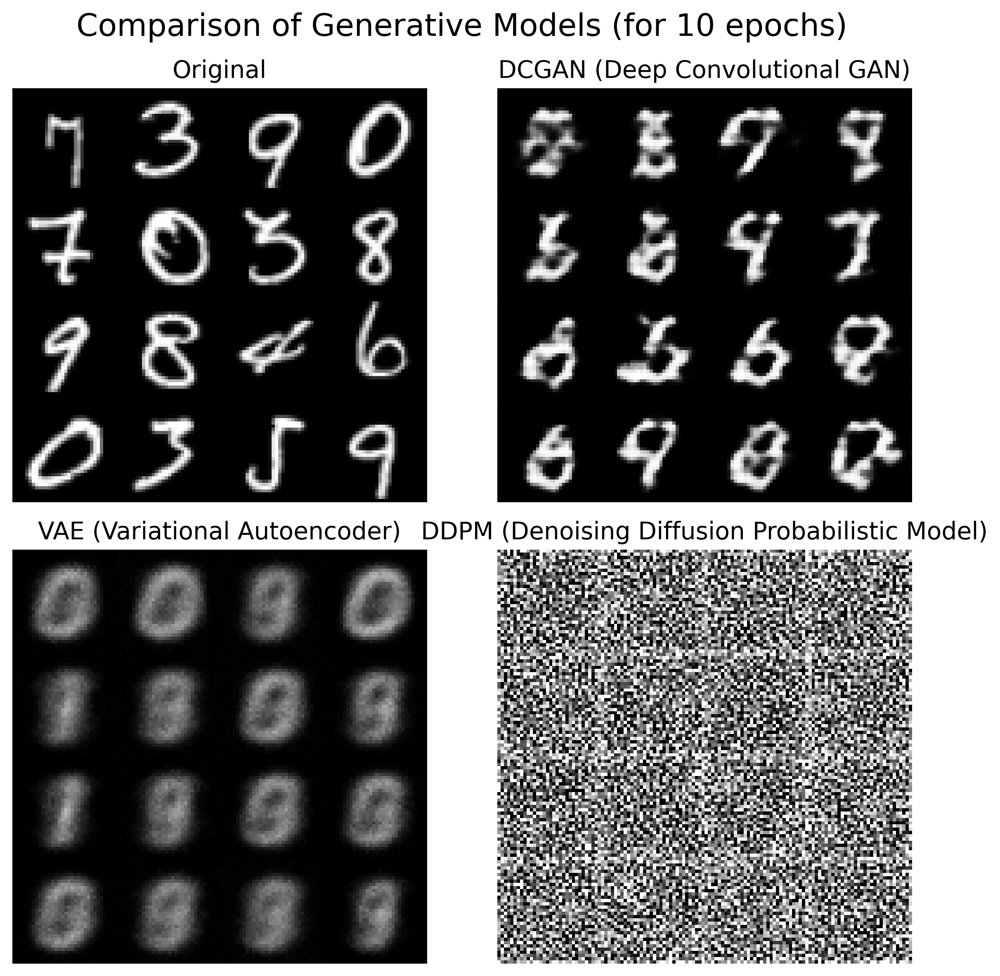

# MNIST Machine Learning Synthetic Data Generation

This repository demonstrates three different generative model families: GANs, Variational Autoencoders, and Diffusion Models for creating synthetic MNIST images.  

| Model | Family | Key Idea |
|-------|--------|----------|
| **DGAN** | GANs (Generative Adversarial Networks) | Train a generator and discriminator in a two-player game |
| **VAE** | Latent-variable models | Learn a latent distribution and reconstruct data through sampling |
| **DDPM** | Diffusion models | Add noise step-by-step, then learn to reverse the process |

## Installation
```bash
git clone https://github.com/carmen14/mnist-ml-generation.git
cd mnist-ml-generation
pip3 install -r requirements.txt
```

## Generate Synthetic Data

```bash
# Run the script with default params (epochs=1, batch_size=64, z_dim=100):
python3 generate_mnist_images.py
# For better results, increase epochs (>100) and set custom params:
python3 generate_mnist_images.py --epochs 100 --batch_size 128 --z_dim 128
```

This script performs the following steps:
- Loads and preprocesses the MNIST dataset (resized to 32x32 and normalized to [-1, 1]).
- Instantiates three models: DCGAN (Deep Convolutional GAN), VAE (Variational Autoencoder), DDPM (Denoising Diffusion Probabilistic Model).
- Generates sample images, plots the original images and model outputs in a 2×2 grid.
- Saves the figure in output/ folder.


